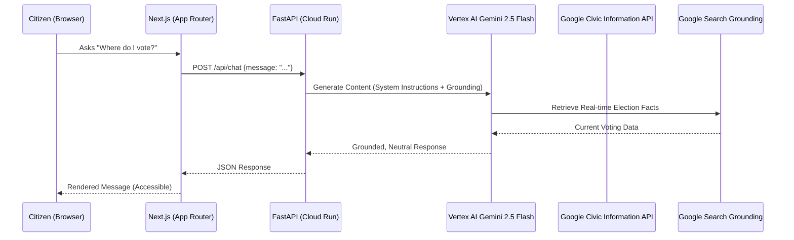

# CivicSense Architecture

CivicSense is designed as a secure, scalable, and impartial AI-driven civic assistant. This document outlines the high-level data flow and technology stack.

## Data Flow Diagram

## Component Breakdown

### 1. Frontend (Next.js)
- **Deployment:** Firebase Hosting.
- **Styling:** Tailwind CSS with a focus on WCAG 2.1 contrast ratios and high-contrast dark mode.
- **Accessibility:** Uses `aria-live` for screen readers and semantic HTML5 landmarks.

### 2. Backend (FastAPI)
- **Deployment:** Google Cloud Run (Containerized).
- **Security:** Strict Pydantic input validation, IP-based rate limiting, and CORS restrictions.
- **Audit:** Structured logging middleware for performance and evaluation auditing.

### 3. AI Services (Vertex AI)
- **Model:** Gemini 2.5 Flash.
- **Grounding:** Native Google Search Grounding to prevent hallucinations in civic data.
- **Safety:** Hardened `HarmBlockThreshold` across all categories.

### 4. Data Services
- **Google Civic Information API:** Directly queried for verified voting location and election schedule data.
