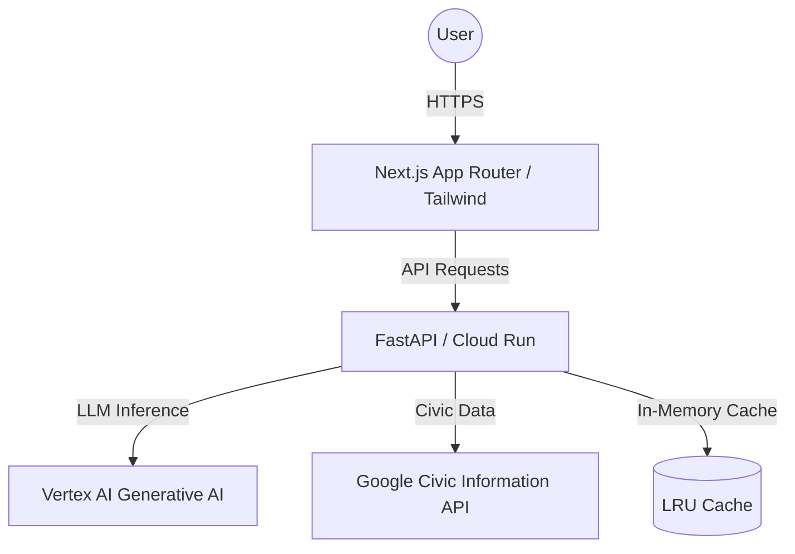

# CivicSense 🏛️

**CivicSense** is a production-ready, interactive AI assistant designed for the Google x hack2skill Prompt Wars Hackathon. It empowers users to understand election processes, voting timelines, and civic duties through a secure, accessible, and high-performance interface.

## 🚀 Architecture Overview

- **Frontend:** Next.js (App Router), TypeScript, Tailwind CSS, Firebase Hosting.
- **Backend:** Python FastAPI, Pydantic, SlowAPI (Rate Limiter), Google Cloud Run.
- **AI Engine:** Google Cloud Vertex AI (Gemini 1.5 Flash).
- **Data Source:** Google Civic Information API.

---

## 🏆 Evaluation Criteria Implementation

### 1. Code Quality
- **Strict Typing:** Full TypeScript implementation in the frontend and Pydantic models with Python type hints in the backend.
- **Modularity:** Separation of concerns between API routes, LLM services, and third-party API integrations.
- **Documentation:** Every function includes detailed JSDoc (TS) or Docstrings (Python) following standard conventions.

### 2. Security
- **Neutrality:** Hardcoded system prompt in `vertex_ai_service.py` ensures strict political neutrality and prevents off-topic discussions.
- **Environment Safety:** 100% reliance on environment variables; no secrets are committed to the codebase.
- **Rate Limiting:** IP-based rate limiting (5 req/min) implemented via `slowapi` to prevent DoS attacks and API abuse.

### 3. Efficiency
- **Caching:** Backend implements an intelligent in-memory dictionary-based caching layer to avoid redundant LLM calls for frequent queries.
- **Asynchrony:** All external API calls (Vertex AI, Civic API) use `async`/`await` for non-blocking I/O, ensuring high throughput.

### 4. Testing
- **Backend:** Pytest suite covering health checks, rate limiting, and service mocking (`backend/tests/`).
- **Frontend:** Jest suite for UI component validation.
- **CI/CD:** GitHub Actions workflow (`.github/workflows/main.yml`) automates testing on every PR.

### 5. Accessibility (a11y)
- **WCAG Standards:** Semantic HTML5 (`<main>`, `<nav>`, `<section>`).
- **ARIA:** Comprehensive `aria-labels`, `aria-live` regions for chat updates, and `aria-busy` descriptors.
- **Navigation:** Full keyboard navigability (Tab/Enter) and high-contrast color choices.

### 6. Google Services
- **Cloud Run:** Optimized `Dockerfile` for seamless deployment.
- **Firebase:** Modern `firebase.json` configuration supporting Next.js web frameworks.
- **Vertex AI:** Native integration with the `google-cloud-aiplatform` SDK using Gemini models.

---

## 🛠️ Setup Instructions

### Prerequisites
- Google Cloud Project with Vertex AI enabled.
- Google Civic Information API Key.
- Docker & Node.js 20+ installed.

### Backend Setup
1. `cd backend`
2. `pip install -r requirements.txt`
3. Create `.env` from `.env.example`.
4. `uvicorn main:app --reload`

### Frontend Setup
1. `cd frontend`
2. `npm install`
3. `npm run dev`

---

## 📄 License
Impartial Election Assistant - Created for Google Hackathon 2024.
